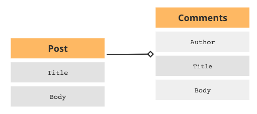

# Blog App using Ruby on Rails

- [Blog App using Ruby on Rails](#blog-app-using-ruby-on-rails)
  * [Overview](#overview)
  * [Schema](#schema)
  * [How to run this project locally?](#how-to-run-this-project-locally-)
  * [Demo](#demo)
    + [Landing Page](#landing-page)
    + [Create New Blog Post](#create-new-blog-post)
    + [View New Post](#view-new-post)
    + [Publish New Post](#publish-new-post)
    + [Delete Your Post](#delete-your-post)
    + [Comments](#comments)
    + [Archive Comment Example](#archive-comment-example)

## Overview
This is a demo blog app made with Ruby on Rails. It allows you to create/edit/delete a post as well as to comment on these posts. You can also set the visibility of your comment as public/private/archived. I have used bootstrap to further enhance the user experience while using this web app. 

## Schema
The post and comment have 1 to many active record association meaning 1 post can have many comments. In future I plan to incorporate advanced concepts such as polymorphic associations in this web app. 

## How to run this project locally?
1. Fork the project.
2. Run `bundle install`
3. Run `rake db:migrate`
4. Run `bin/rails server`

## Authentication

## Demo
### Landing Page
The landing page of this website for blogging enthusiasts is designed to make blogging a breeze. As soon as you log in, you can easily create new blog posts or access your existing ones, all from one page. The interface is user-friendly and intuitive, making it easy for even novice bloggers to get started. You can view all your posts in one place and have the option to edit or delete any post at any time. With the ability to manage and organize your content seamlessly, you can focus on creating engaging and captivating blog posts that will keep your readers coming back for more.

### Create New Blog Post
The landing page of "Creating New Post" page allows you to give a title and content to your post and also allows you to set visibility for this post as public/private/archived. Archived posts won't be visible on the landing page.

### View New Post
Once you click on the "Create Post" button, your blog will be assigned a dedicated page where both you and your readers can view your post. This page also provides a comment section, where people can leave their feedback and engage in a discussion with you and other readers. Furthermore, you will find helpful edit and delete buttons that enable you to swiftly make changes or remove your post, streamlining the process for you.

### Publish New Post
After finalizing and reviewing your post, you can publish it by clicking on the "Create Post" button. This will display your post on the landing page of the website, where you and other users can view it. Additionally, the landing page entry for your post will include both edit and delete buttons, providing easy access to these functions.

### Delete Your Post
Deleting your post is a straightforward process. Simply click on the red delete button, and a prompt will appear, asking if you are sure you want to delete your post. Upon confirming, your post will be permanently removed, and it will no longer be visible on the landing page.

The image below displays the absence of your deleted post on the landing page.

### Comments
You and your readers have the ability to add comments to your blog, which will appear below the post on its dedicated page. Commenters have the option to publish their comments as public, private, or archived. Archived comments will not be visible on the web app. Once a comment is published, it will be displayed in chronological order below your blog post.

### Archive Comment Example

