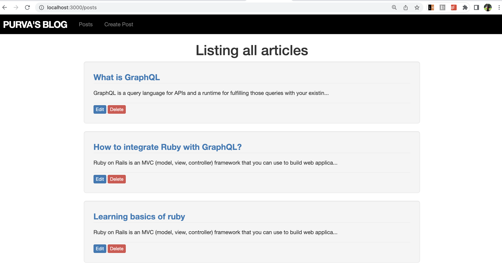

# Blog App using Ruby on Rails

## Overview
This is a demo blog app made with Ruby on Rails. It allows you to create/edit/delete a post as well as to comment on these posts. You can also set the visibility of your comment as public/private/archived. I have used bootstrap to further enhance the user experience while using this web app. 

## Schema
The post and comment have 1 to many active record association meaning 1 post can have many comments. In future I plan to incorporate advanced concepts such as polymorphic associations in this web app. 

## Demo
### Landing Page
The landing page of this website for blogging enthusiasts is designed to make blogging a breeze. As soon as you log in, you can easily create new blog posts or access your existing ones, all from one page. The interface is user-friendly and intuitive, making it easy for even novice bloggers to get started. You can view all your posts in one place and have the option to edit or delete any post at any time. With the ability to manage and organize your content seamlessly, you can focus on creating engaging and captivating blog posts that will keep your readers coming back for more.

